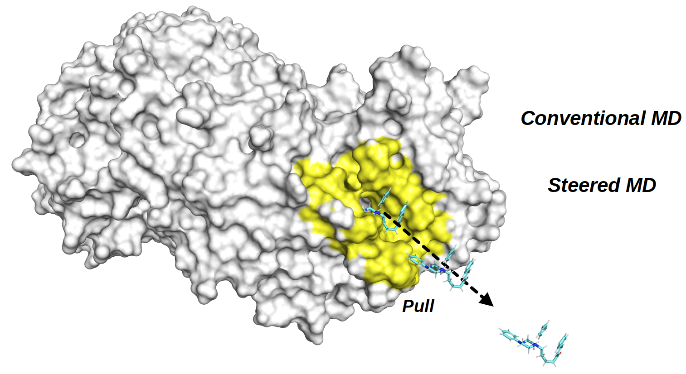

# AmberMDHelper
Scripts used to setup molecular dynamics simulations using AMBER software.
_UPCOMING_: Setup MM/PBSA rescoring.
## Software requirements
- Software:
  - Linux environment.
  - Bash. Tested with ```GNU bash, version 5.2.37(1)-release (x86_64-pc-linux-gnu)```
  - AmberTools. Tested with version 24 and 25.

## setup_MD.sh
setup_MD.sh script configures conventional molecular dynamics simulations:
- Prepare all required input files for the generation of topology and molecular dynamics (MD) input files.
- Build a reproducible directory structure based on the receptor, ligands, cofactor, and number of replicas.
- Process receptor, ligand, and cofactor files using, which includes:
  - Parameterization of ligands and cofactors, including partial charge calculation.
  - Generation of both dry and solvated topology and coordinate files.
Ligand and cofactor are optional.
### Requirements
A working directory containing:
 - ```receptor``` folder: This folder must contain a single PDB file of the receptor.
 - ```ligands``` folder (optional): This folder must contain ligands files in mol2 format. Ligand must be already protonated.
 - ```cofactor``` folder (optional): This folder should contain a single cofactor file in mol2 format. Cofactor must be already protonated.
### Usage
Use ```-h```, ```--help``` options to show script help.
```bash
bash setup_MD.sh --help # get help.
```
Output:
```
Required options:
 -d, --work_dir     <path>       Working directory. Inside this directory, a folder named setupMD will be created which contains all necessary files.
Optional:
 -h, --help                      Show this help.
 --prod_time        <integer>    (default=100) Simulation time (in ns) (2 fs timestep).
 --equi_time        <integer>    (default=10) Simulation time (in ns) of last step of equilibration (2 fs timestep)
 -n, --replicas     <integer>    (default=3) Number of replicas or repetitions.
 --prot_only        <0|1>        (default=0) Setup only protein MD.
 --prot_lig         <0|1>        (default=0) Setup protein-ligand MD.
 --prep_rec         <0|1>        (default=1) Prepare receptor. Receptor MUST be already protonated.
 --prep_lig         <0|1>        (default=0) Prepare ligand. Ligand MUST be already protonated.
 --include_cof      <0|1>        (default=0) Include cofactor.
 --prep_cof         <0|1>        (default=0) Prepare cofactor if --include_cof 1. Cofactor MUST be already protonated.
 --prep_topology    <0|1>        (default=0) Prepare topology files.
 --prep_MD          <0|1>        (default=1) Prepare MD input files.
 --calc_lig_charge  <0|1>        (default=1) Compute ligand (and cofactor) atoms' partial charges if --prep_lig 1.
 --charge_method    <string>     (default=abcg2) Charge method if --calc_lig_charge 1.
 --lig_ff           <gaff|gaff2> (default=gaff2) Small molecule forcefield. This applies both ligand and cofactor.
 --prot_ff          <string>     (default=ff19SB) Protein forcefield.
 --water_model      <string>     (default=opc) Water model used in MD.
 --box_size         <integer>    (default=14) Size of water box.
```
### Working directory example
Below there is an example of a working directory with the required receptor, but no ligand and cofactor.

```bash
WDPATH
├── cofactor
├── ligands
└── receptor
    └── rec_name.pdb
```
Below there is an example of folder structure created with setupMD script. This just create the directories.
```bash
bash setup_MD.sh -d . -n 1 --prot_only 1 --prep_topology 0 --prep_rec 0 --prep_MD 0
```
```bash
WDPATH
├── cofactor
├── ligands
└── setupMD
    └── rec_name
        └── onlyProteinMD
            ├── MD
            │   └── rep1
            │       ├── equi
            │       │   ├── npt
            │       │   └── nvt
            │       └── prod
            │           ├── npt
            │           └── nvt
            └── topo
```
### MD Protocol
The default MD protocol consist of two stages: equilibration and production:
- Equilibration:
  - 2 restrained minimization.
  - Restrained NVT MD to raise temperature.
  - 5 Restraint-releasing NPT MD.
  - Final unrestrained NPT MD. The duration of this step is controlled via ```--equi_time``` option.
- Production:
  - Unrestrained NPT. The duration of this step is controlled via ```--prod_time``` option.

## setup_AMSD.sh
setup_ASMD.sh script configures Adaptative Steered Molecular Dynamics:
- Creates a reproducible folder structure.
- Calculates initial distance between lig atoms and prot atoms.
- Creates distance restraint file which depends on the number of stages.
- Creates input files for the required number of trajectories per stage under NVT ensemble.
- It uses Amber atom mask. You don't have to manually configure atoms' id.
### Requirements
- A working directory containing:
  - Solvated Protein-Ligand topology.
  - Coordinate file (rst7 format). Usually obtained from equilibrated system.
### Usage
Use ```-h```, ```--help``` options to show script help.
```bash
bash setup_ASMD.sh --help # get help.
```
Output:

```Required options:
 -p, --topo <file>           : Topology file.
 -c, --coord <file>          : Equilibrated rst7 file.
 --prot_mask <AMBER MASK>    : AMBER mask of protein atoms.
 --lig_mask <AMBER MASK>     : AMBER mask of ligand atoms.
 --pull_length <numeric>     : Total pull length (Å). Use positive or negative values to 
                               increase or decrease distance between ligand and protein, respectively. 
                               Ignored if --end_distance is provided.
Optional:
 --stages <integer>          : (default=5). Number of stages to split the reaction coordinate.
 --n_traj <integer>          : (default=25). Number of trajectories per stage.
 --velocity <numeric>        : (default=10). Pulling velocity (Å/ns).
 --force_k <numeric>         : (default=7.2) Force constant (kcal * mol⁻¹ * Å⁻²).
 --start_distance <numeric>  : Manually set start distance between ligand atom(s) and protein atom(s).
                                If not provided, start distance is automatically calculated using cpptraj from protein and ligand SMD atoms.
 --end_distance <numeric>    : Manually set final distance between ligand atom(s) and protein atom(s) if --pull_length is not provided.
 --create_pdb                : Create a PDB file from topology and rst7 file. You can use this PDB to
                                visualize and check the SMD atoms. This will create a PDB of the complex
                                and another PDB for the selected atoms for SMD.
 --debug                     : Print details of variables used in this scripts.
 -h, --help                  : Show this help.
```

Example:

```bash
bash setup_ASMD.sh -p solvated_complex.parm7 -c equil_coord.rst7 --prot_mask :358 --lig_mask :560 --pull_length 30 --stages 3 --n_traj 2
```

Directories created

```
10_A_ns/
└── force_7.2
    └── 3_stages_2_trajs
        ├── stage_1
        ├── stage_2
        └── stage_3
```
where
```
stage_1/
├── SMD_distance_restraint_stage_1.RST
├── SMD_stage_1_traj_1.in
└── SMD_stage_1_traj_2.in
```

### Check SMD atoms
In order to check which atoms are being used in ASMD, check ```--create_pdb``` option. If used, it creates PDB files for complex, ligand and protein atoms.
You can easily visualize this in programs like PyMol.
Example:
```
bash setup_ASMD.sh --create_pdb -p solvated_complex.parm7 -c equil_coord.rst7 --prot_mask :358 --lig_mask :560 --pull_length 30 --stages 3 --n_traj 2
```
Output

```
WDPATH
├── COMPLEX.pdb
├── SMD_LIG_ATOMS.pdb
└── SMD_PROT_ATOMS.pdb
```
## run_ASMD.sh
Perform ASMD.
### Requirements
- Directory containing the output of ```setup_ASMD.sh```
- Solvated Protein-Ligand topology.
- Coordinate file (rst7 format). Usually obtained from equilibrated system.
- Numpy package ()
- ASMD.py. Thanks to T. Dwight McGee Jr., Hailey Bureau, Caley Allen, Rigoberto Hernandez for providing ASMD.py script in
<https://ambermd.org/tutorials/advanced/tutorial26/> tutorial. **ASMD.py provided here supports python3** but I haven't extensively tested (I used Python 3.13.3).
### Usage
Use ```-h```, ```--help``` options to show script help.
```bash
bash setup_ASMD.sh --help # get help.
```
Output:

```
Required options:
 --wd <path>                 : Working directory.
 -p, --topo <file>           : Topology file.
 -c, --coord <file>          : Equilibrated rst7 file.
 --velocity <numeric>        : Pulling velocity (Å/ns).
 --stages <integer>          : Number of stages.
 --n_traj <integer>          : Number of trajectories per stage.
 --force_k <numeric>         : Force constant (kcal * mol⁻¹ * Å⁻²).
Optional:
 --temp <numeric>            : (default=300). MD temperature.
 --MD_prog <string>          : (default=pmemd.cuda). MD program (sander, pmemd.cuda, etc).
 --only_process              : Only process SMD data.
 --debug                     : Print details of variables used in this scripts.
 --dry-run                   : Show run command.
 -h, --help                  : Show this help.

```

In the ```setup_ASMD.sh``` example, we configured ASMD with a velocity of 10 A/ns, 3 stages and 2 trajectories per stage.
In order to run ```run_ASMD.sh``` script, we're going to use the same parameters, which are required options.

```
bash run_ASMD.sh --wd . --topo complex_solvated.parm7 \
--coord equilibrated_complex.nc --velocity 10 \
--stages 3 --n_traj 2 --force_k 7.2
```

